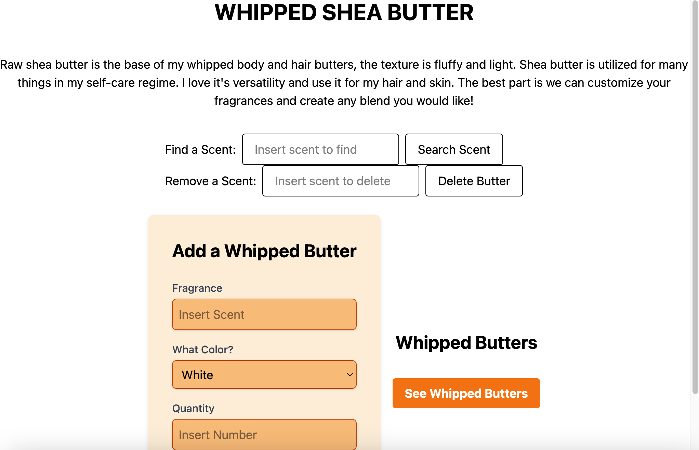

#  Eventonica App
This project is a fullstack app that displays fragrant body butters with different scents.

## Table of Contents
1. [Installation Instructions](#installation)

2. [How to Set Up Project](#run-project-locally)

3. [Demo](#demo)

## Installation
❗️ My instructions are specified for **MAC users.**  

❗️ Prior to jumping into my project make you install: 

- Postgresql
- express
- vite/react
- Jest

The code editor I used for this project was VS Code. 
- Follow these steps to [install Express](https://expressjs.com/en/starter/installing.html) on your VS Code terminal (they also provide documentation to install node.js)

✅ **You _MUST have these installed_** in order to run my project.

## Run Project Locally
Clone my project below from your terminal

```bash
git clone https://github.com/courjimen/New-Eventonica.git
```

Open in VS Code
```bash
code .
```
Navigate to the server folder and open the server.js file then run this command:

```bash
npm run server
```

Now navigate to the client folder and open the app.jsx file, open a _separate terminal_ you need to have <ins>both <ins> running at the same time ❗️

Run vite in your second terminal for the app.jsx file:

```bash
npm run dev
```
Follow the provided link to localhost:5173 which should display: 


## Demo
Now you should be able to see and interact with the homepage:



That's all folks 🎉 Thank you for checking out my work 🙌🏾